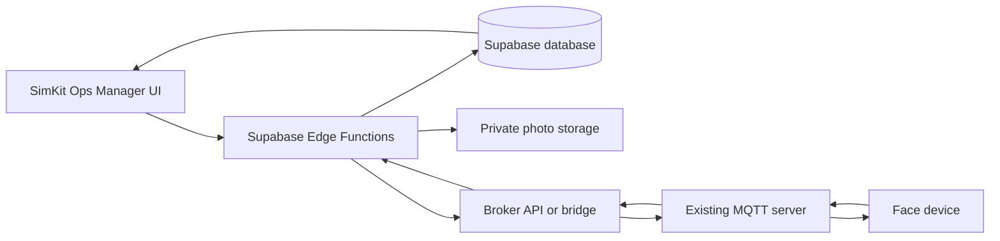

# SimKit Ops Attendance: Simple Architecture and Data Flow

Date: 6 October 2026

This document explains the system in plain language. The user subsequently authorized local implementation. Application code, a database migration, Edge Functions, and an optional MQTT bridge are now in the workspace; no live server/database deployment has been performed. See `ATTENDANCE_DEPLOYMENT.md` for setup.

Confirmed during implementation: office starts at 10:00 AM, with initial grace set to 15 minutes within the requested 10–15 minute range. The supplied device screenshot identifies `AYUE22065256` and `aiface/AYUE22065256/sub/stellar`, carrying scan logs; enrollment commands still require firmware confirmation.

An optional enrollment alternative now leaves all bridge scripts unchanged:

```text
Add user -> Supabase saves employee -> enrollment Edge Function
         -> direct short MQTT connection -> existing broker -> device
         <- matching device response while the connection is open
         -> save confirmation -> disconnect
```

This mode uses `ATTENDANCE_PUBLISH_MODE=mqtt`. It waits up to 10 seconds and marks Enrolled only after a mapped device response matches the command, employee, and serial. Missing confirmation stays pending. It does not replace continuous attendance scan ingestion; scans or late responses still need a broker webhook, existing bridge, or device HTTPS callback. Setup details are in `ATTENDANCE_DEPLOYMENT.md`.

## 1. The main parts

| Part | What it does |
| --- | --- |
| SimKit Ops Manager UI | Lets the manager add employees, view attendance/photos, and approve leave |
| Supabase database | Saves employees, attendance history, settings, enrollment status, and leave requests |
| Supabase Edge Functions | Handle backend actions: enrollment commands, incoming scans, photo access/cleanup, and incoming leave emails |
| Supabase private Storage | Stores attendance photos temporarily |
| Existing MQTT server | Transfers messages to and from the face device; existing address: `62.72.43.204:1883` |
| Face device | Enrolls/recognizes employee faces and sends scan events |
| Broker API/webhook or bridge | Connects MQTT messages with Supabase HTTPS requests |

**Supabase is the attendance backend. Your existing MQTT server handles communication with the device.**

## 2. Why we need the MQTT connection layer

The device speaks MQTT. The proposed Supabase functions receive short HTTPS requests and perform an action.

We connect them using one of these options:

1. **Broker API and webhooks:** if your MQTT broker already supports these, use its API to send commands and its webhooks to forward device events.
2. **Small bridge program:** if those features are missing, run a program on your existing MQTT server. It listens for device messages and forwards them to Supabase. It also provides a protected HTTPS endpoint for Supabase to send device commands.

The bridge does not manage employee records or calculate attendance. Those tasks stay in Supabase. We do not need a new MQTT server.

The screenshot confirms the MQTT address and shows TLS disabled in that client configuration. It does not identify the broker software or prove that an HTTP API/webhook exists. Port `1883` is the displayed MQTT port, not an HTTP API address. We still need the broker software name to choose the integration method.

A Supabase Edge Function should not be the always-running MQTT listener because hosted functions have limited execution lifetimes. The broker or bridge handles continuous listening. See [Supabase function limits](https://supabase.com/docs/guides/functions/limits).

## 3. Overall picture



There are two main directions:

- **Command going out:** Manager UI → Supabase → broker API/bridge → MQTT → device.
- **Event coming back:** Device → MQTT → webhook/bridge → Supabase → Manager UI.

## 4. Flow: manager adds an employee

The manager enters:

- Name.
- Department: Firmware, Hardware, Logistic, Software, or Manager.
- Enroll ID, which identifies the employee on the device.

```text
Manager fills the employee form
              ↓
Clicks Submit
              ↓
Supabase Edge Function checks manager access and form values
              ↓
Saves employee and pending enrollment command in the database
              ↓
Sends command through broker API or bridge
              ↓
Existing MQTT server receives the command
              ↓
Publishes to devicename/serino/sub/stellar
              ↓
Face device receives the enrollment command
```

The device subscribes to the command topic; the backend publishes to it. The actual fixed device name and serial number still need confirmation.

The device sends an acknowledgment back:

```text
Device enrollment response
              ↓
MQTT server
              ↓
Broker webhook or bridge
              ↓
Supabase Edge Function updates enrollment status
              ↓
Manager sees the result
```

The UI shows **Saved — enrollment pending**, then **Enrolled** after the device confirms. If it fails, show the failure and a retry action. Publishing a command alone does not prove enrollment succeeded.

Saving in the database and sending through MQTT are separate actions. Saving the pending command makes failed sending recoverable without creating the employee again.

The device may require the employee to stand in front of it to capture their face after receiving the command. We need the actual firmware instructions to confirm this step. A department of Manager does not automatically give an employee dashboard access.

## 5. Flow: employee scans their face

```text
Employee scans face at the device
              ↓
Device recognizes their enroll ID
              ↓
Device sends scan event through MQTT
              ↓
Existing MQTT server receives it
              ↓
Broker webhook or bridge forwards it to Supabase
              ↓
Attendance Edge Function checks the sender and event
              ↓
Finds employee using enroll ID
              ↓
Saves scan time and attendance record in the database
              ↓
Saves the photo in private Storage, if available
              ↓
Manager Attendance screen refreshes
```

For example, an event means: **Enroll ID 104 scanned at 9:47 AM, with this photo.** Supabase looks up ID 104 and finds **Rahul, Software**.

The manager sees:

| Employee | Department | Date | Entry time | Status | Photo |
| --- | --- | --- | --- | --- | --- |
| Rahul | Software | 6 Oct 2026 | 9:47 AM IST | Late | View photo |

This is an example, not the actual device payload. We still need the real scan topic, payload, timestamps, event IDs, and photo format.

Face matching happens on the device. Supabase receives the recognized employee ID and evidence; it does not perform face recognition.

## 6. Flow: first entry and late calculation

For the initial version, the earliest valid entry scan on a local date is the employee's entry time. Other distinct scans stay in history. Duplicate delivery of the same event does not create duplicate attendance.

Configure office start time and grace period in attendance settings. Example only:

```text
Office starts:       9:30 AM
Grace period:        10 minutes
Allowed until:       9:40 AM
Employee enters:     9:47 AM
Result:              Late by 7 minutes
```

In this example, arrival at exactly 9:40 AM is on time; after 9:40 AM is late. The example measures late minutes after the grace threshold. The real times and business rule need confirmation.

Supabase calculates the result, and the UI shows an amber highlight with a Late badge. Dates and displayed times use `Asia/Kolkata`; stored timestamps use UTC.

If an earlier scan arrives later because of a connection delay, the daily entry and late result can be corrected from that event. Keep the change history. Checkout and working hours require separate rules and are not part of this initial entry-only proposal.

## 7. Flow: photo expires, attendance stays

Photos and records are stored separately:

```text
Supabase database                  Private Supabase Storage
-----------------                  ------------------------
Employee                           Photo file
Date
Entry time
Late status
Photo reference and expiry
```

Proposed expiry is 24 hours after the validated scan time. Confirm whether the business instead wants 24 hours after upload.

```text
Photo reaches its 24-hour expiry
              ↓
Backend stops issuing access to the photo
              ↓
Scheduled cleanup runs, normally every minute
              ↓
Cleanup function deletes the actual file from Storage
              ↓
Database marks the photo as deleted
              ↓
Attendance record remains available
```

The manager still sees employee name, date, entry time, and attendance status. The photo column shows **Photo expired after 24 hours**.

Access ends at expiry. Physical file deletion normally follows in the next scheduled minute and may take longer during a failed job or outage. Failed deletion is retried. Use the [Storage deletion API](https://supabase.com/docs/guides/storage/management/delete-objects) for files and [Supabase Cron](https://supabase.com/docs/guides/cron/quickstart) to schedule cleanup.

Photos remain private and are viewed through manager authorization and short-lived access links. Photo upload failure does not discard attendance. A photo received after its expiry should not be stored. Any photo copies on the device or MQTT server need their own retention configuration; Supabase cleanup cannot delete those copies.

## 8. Flow: leave request through email

```text
Employee emails the dedicated leave address
              ↓
Inbound email provider forwards the message to an Edge Function
              ↓
Function checks the webhook and matches employee email
              ↓
Supabase saves a Pending leave request
              ↓
Manager sees the request in Leave Requests
              ↓
Manager approves or rejects it
              ↓
Approved dates show On leave
```

Email receipt creates a request; it does not approve leave. Employee email mapping and an inbound email provider/mailbox integration are needed. Supabase itself is not the email inbox.

Show employee, requested dates, reason, and decision status. Unclear dates or unknown senders require manager review. Duplicate email delivery must not create duplicate requests.

If the employee scans during approved leave, keep the scan and flag the conflict. Initially, the manager can also record leave manually while email integration is being arranged.

## 9. What the manager sees

Add one **Attendance** item to Manager navigation, with three tabs:

| Tab | Main actions |
| --- | --- |
| Daily Attendance | Select date, search employee, filter department/status, view entry time and photo, see late highlights |
| Manage Users | Add employee, see enroll ID and enrollment status, retry enrollment, deactivate employee |
| Leave Requests | Review pending requests and approve/reject leave |

Use the existing SimKit theme, readable tables on desktop, cards on mobile, clear status badges, and subtle late highlighting. Historical dates remain useful after photos expire.

Device status should remain Unknown until actual heartbeat/status information is available. Include last scan/sync time and clear connection warnings.

## 10. If the device or connection stops working

- Employees stay saved, with enrollment pending until a command succeeds and the device confirms.
- Pending commands retry with limits and visible failures.
- Scans can arrive later if the device or bridge supports durable buffering; that capability must be confirmed.
- Store scan time separately from server receipt time so delayed delivery does not automatically mean a late employee.
- Do not automatically classify missing scans as absence while ingestion is unhealthy.
- Attendance and photo cleanup run on the backend even when no manager has the UI open.

## 11. Details needed to turn the proposal into implementation

1. Broker software on the existing server and whether it supports HTTP publishing/webhooks or can host a bridge.
2. Fixed device name and serial number.
3. Real enrollment command, acknowledgment, and scan payloads, including their topics.
4. Photo format and device face-enrollment procedure.
5. Office timing, grace period, working days, and absence cutoff.
6. Confirmation of the photo expiry clock and scheduled deletion timing.
7. Leave email address/provider and employee email mapping.

This document supplements `MANAGER_DEVICE_ATTENDANCE_PLAN.md`. The original file contains the fuller schema, security, reliability, and implementation proposal.
