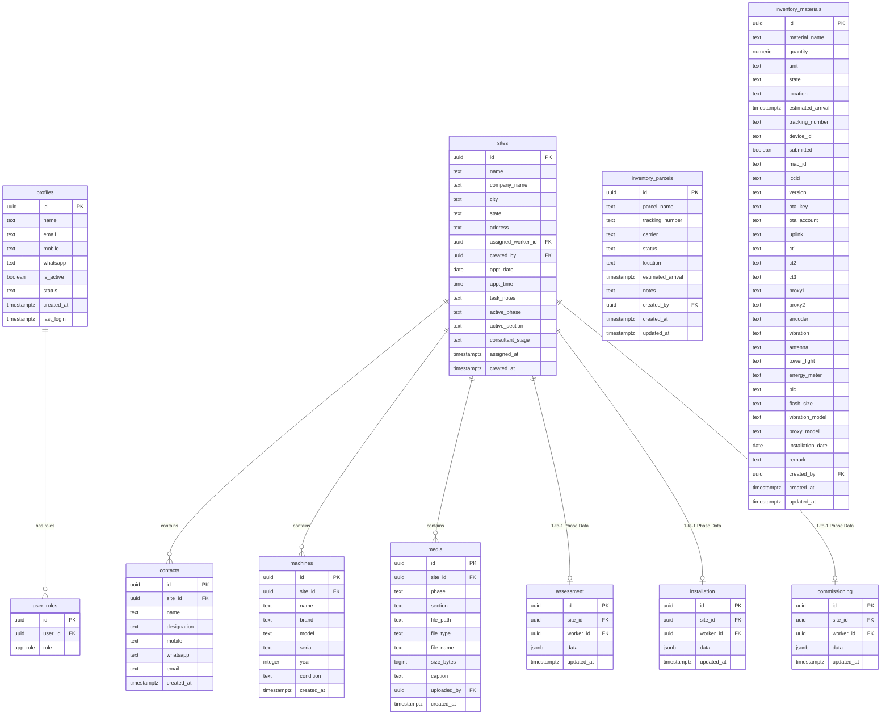

# SIM-Kit Ops — Database Schema & Architecture Guide

This document details the database schema, security rules, integrations, and serverless deployment configurations of the **SIM-Kit Ops** project.

---

## 🏗️ 1. Project Foundation Overview

The application is built on a full-stack React framework integrated with a Serverless database layer:

```
┌────────────────────────────────────────────────────────┐
│                   Vite / React 19                      │  ◄── Frontend (TanStack Router & Query)
└───────────▲────────────────────────────────▲───────────┘
            │ (Realtime / API queries)       │ (Auth Session)
┌───────────▼────────────────────────────────▼───────────┐
│                  Nitro Server Engine                   │  ◄── Serverless Middleware (TanStack Start)
└───────────▲────────────────────────────────▲───────────┘
            │                                │ (Service Role / Admin)
┌───────────▼───────────┐        ┌───────────▼───────────┐
│   Supabase Auth       │        │   Supabase DB / RLS   │  ◄── PostgreSQL (Hosted on Supabase)
│   (User Identity)     │        │   (Storage Buckets)   │
└───────────────────────┘        └───────────────────────┘
```

*   **TanStack Start & Nitro**: Runs on the server side (SSR) and handles API routing, server actions, and HTML generation.
*   **Supabase (PostgreSQL)**: Handles data storage, user authentication, binary asset management, and live synchronization.
*   **Row Level Security (RLS)**: Enforces security policies directly inside the database, preventing unauthorized data exposure regardless of frontend code.

---

## 📊 2. Database Schema & Tables

### ER Diagram



---

### Detailed Table Specifications

#### 1. `profiles`
Represents the user details of internal employees (workers/supervisors/owners).
*   **`id`** (`uuid`, Primary Key): References `auth.users(id)` in Supabase Auth.
*   **`is_active`** (`boolean`, Default `false`): Used for verification gating.
*   **`status`** (`text`, Default `'assigned'`): Active workspace state.

#### 2. `user_roles`
Maps users to permission states.
*   **`role`** (Custom Enum `public.app_role`): Can be `'worker'`, `'supervisor'`, or `'owner'`.
*   **Unique Constraint**: `(user_id, role)` ensures a user cannot double-register a role.

#### 3. `sites` (Master Table)
Represents the factories and client entities where operations take place.
*   **`assigned_worker_id`** (`uuid`, nullable): References the business consultant (`auth.users`).
*   **`company_name`** (`text`): Grouping index used to roll up multiple site locations to a parent brand in supervisor reports.
*   **`consultant_stage`** (`text`, Check Constraint): Restricts values to `NULL`, `'Billing'`, or `'Completion'`. It is set by the consultant upon task wrap-up.
*   **`task_notes`** (`text`): Employs a specific metadata block convention (e.g., `[METADATA:{"status":"...", ...}]`) for backward compatibility with import trackers and secondary attributes (visit logs, worker arrays).

#### 4. Stage Tables (`assessment`, `installation`, `commissioning`)
Three tables matching the lifecycle of a site.
*   **`site_id`** (`uuid`, Unique, Cascade Delete): Creates a 1-to-1 metadata relation with `sites`.
*   **`data`** (`jsonb`): Stores questionnaire responses, checks, dynamically added custom fields, and form inputs.

#### 5. `inventory_parcels` & `inventory_materials`
Manage company resources and shipping pipelines.
*   `inventory_parcels` tracks courier updates (`carrier`, `tracking_number`, `status`).
*   `inventory_materials` tracks devices (gateways, CT clamps, vibration modules, and SIM configurations) including properties like MAC address, cellular ICCID, software version, and hardware sensor flags.

---

## 🔐 3. Supabase Security & Integration

### A. RLS Policies (Row Level Security)

Security starts in PostgreSQL. The system uses a set of helper functions to resolve request claims (`auth.uid()`):

1.  **`public.is_staff(_user_id)`**:
    ```sql
    SELECT EXISTS (
      SELECT 1 FROM public.user_roles
      WHERE user_id = _user_id AND role IN ('supervisor','owner')
    )
    ```
2.  **`public.can_access_site(_site_id)`**:
    ```sql
    SELECT public.is_staff(auth.uid())
      OR EXISTS (SELECT 1 FROM public.sites s WHERE s.id = _site_id AND s.assigned_worker_id = auth.uid())
    ```

#### Policy Mapping Matrix

| Table | SELECT Policy | INSERT/UPDATE Policy | DELETE Policy |
| :--- | :--- | :--- | :--- |
| **`profiles`** | Own profile OR staff | Own profile OR staff | Staff only |
| **`sites`** | Assigned worker OR staff | Staff only | Staff only |
| **`assessment`/`installation`/`commissioning`** | `can_access_site(site_id)` | `can_access_site(site_id)` | Staff only |
| **`inventory_parcels`/`materials`** | All authenticated | Staff only | Staff only |

> [!NOTE]
> Since workers lack general `UPDATE` permissions on the `sites` table, they can transition a site's stage to `'Billing'` or `'Completion'` only by calling the database RPC function `set_consultant_site_stage(site_id, stage)`. This function is declared with `SECURITY DEFINER` (meaning it runs with administrative privileges) but verifies that the executing user (`auth.uid()`) is the assigned consultant before making changes.

---

### B. Supabase Client Architecture

The codebase splits Supabase operations by context:

*   **Client Proxy (`src/integrations/supabase/client.ts`)**: Used on the browser. Pulls credentials from `sessionStorage` and attaches the user's JWT.
*   **Server Proxy (`src/integrations/supabase/client.server.ts`)**: Bypasses RLS by using the `SUPABASE_SERVICE_ROLE_KEY`. This is restricted to server actions and must never be exposed to the client side.
*   **Auth Middleware (`src/integrations/supabase/auth-middleware.ts`)**: Evaluates incoming headers on API endpoints to verify token claims and initialize context fields for TanStack server handlers.

---

## 🚀 4. Production Setup

```
[ Git Push ] ──► [ Vercel Build Pipeline ] ──► [ Bundled Output ] ──► [ Serverless Execution ]
                         │
                         ├── Reads vite.config.ts
                         └── Injecting Env Vars: SUPABASE_URL,
                                                 SUPABASE_PUBLISHABLE_KEY,
                                                 SUPABASE_SERVICE_ROLE_KEY
```

### A. Environment Configuration
Create or configure a `.env` file for local development:
```env
SUPABASE_PROJECT_ID="your_project_id"
SUPABASE_PUBLISHABLE_KEY="eyJhbGciOi..."
SUPABASE_URL="https://your_project_id.supabase.co"
SUPABASE_SERVICE_ROLE_KEY="eyJhbGciOi..." # (Server-only)
```

### B. Vercel Build Setup
Vercel is the primary hosting platform. The configurations are specified in `vercel.json` and `vite.config.ts`:

1.  **Vercel Routing**:
    `vercel.json` configures the build target:
    ```json
    {
      "buildCommand": "npm run build",
      "framework": null,
      "cleanUrls": true,
      "trailingSlash": false
    }
    ```
2.  **Vite / Nitro preset adaptation**:
    During `vite build`, the configuration checks if the runner environment is Vercel. If so, it adjusts the engine target:
    ```typescript
    nitro: process.env.VERCEL ? { preset: "vercel" } : {}
    ```
    This builds the application into Vercel's `.output/` structure, which configures functions and assets for instant global delivery.
