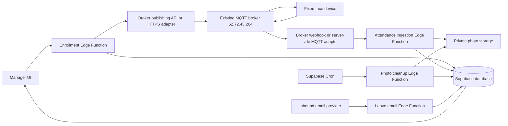

# SimKit Ops: Manager Device Attendance Proposal

Date: 6 October 2026

Status: Local implementation authorized by the user and added to the workspace. No live Supabase migration, deployment, or MQTT server changes have been performed. See `ATTENDANCE_DEPLOYMENT.md` for activation steps and remaining firmware configuration.

Implementation clarification: the user confirmed a 10:00 AM start and 10–15 minutes grace. Initial grace is 15 minutes, editable in Office settings. A later screenshot identifies serial `AYUE22065256` and scan topic `aiface/AYUE22065256/sub/stellar` (two l characters), carrying `sendlog`. The enrollment direction/command, photo field, acknowledgment mapping, face mode, and entry flag meanings still require confirmation.

Later user constraint: leave bridge scripts unchanged and use an alternative enrollment flow. An optional `ATTENDANCE_PUBLISH_MODE=mqtt` path now publishes directly from the enrollment Edge Function to the existing MQTT broker and waits briefly for a correlated device acknowledgment. It requires the additional `20261006160000_attendance_direct_mqtt.sql` migration and actual firmware template/response mapping. Continuous scan ingestion retains its existing integration requirement. See the direct MQTT subsection of `ATTENDANCE_DEPLOYMENT.md`.

## 1. What we are building

Add **Attendance** to the Manager navigation, with three tabs: **Daily Attendance**, **Manage Users**, and **Leave Requests**. Use one fixed face attendance device connected to MQTT.

The manager adds an employee with name, department, and enroll ID. The application saves the employee in Supabase and sends an enrollment command to the device. When the employee scans their face, a device event reaches a Supabase Edge Function, which records the entry and photo. The manager sees attendance by date and employee name, with late arrivals highlighted. Delete photos after their 24-hour retention period while preserving attendance history.

Attendance employees do not necessarily need SimKit login accounts. An employee's department being `manager` must not grant access to the Manager dashboard.

## 2. Existing project context

- The project uses React, TanStack Router, Supabase, and existing shared UI components.
- Manager routes currently authorize the `supervisor` application role in `src/routes/manager.tsx`.
- Manager navigation lives in `src/components/staff/StaffShell.tsx`; the proposed new route is `/manager/attendance`.
- A Supabase Edge Function already exists under `supabase/functions/notify-factory-form-telegram/`.
- Existing `field_attendance_events` track field associates marking online/offline. Device-based office attendance should have its own tables and interface, without changing those workflows or earnings rules.
- Repository files show integration structure, not proof of what is deployed in the live Lovable/Supabase environment. Check deployment access and available broker features before implementation.

## 3. Backend architecture without a separate application server

**Recommendation: keep the existing MQTT server, and use Supabase Edge Functions + PostgreSQL + private Storage + Cron for the attendance backend. Connect the two through authenticated HTTPS integration.**

### Existing MQTT connection supplied by the user

The supplied connection screenshot shows:

| Setting | Observed value |
| --- | --- |
| Connection display name | `limelight` |
| Broker host | `62.72.43.204` |
| MQTT port | `1883` |
| Protocol | `mqtt://` |
| Username | Configured in the client; keep credentials in server secrets |
| Password | Masked; not available from the screenshot |
| TLS encryption | Disabled in the displayed client configuration |

The user confirms this MQTT server already runs on another server. Reuse it; a new broker is not part of this proposal. The screenshot shows client connection settings, not the broker software, HTTP endpoints, successful connectivity, or webhook support. No connection to this server has been attempted during planning.

MQTT port `1883` is the shown MQTT connection endpoint; do not treat it as an HTTP publishing API. Determine the actual broker product and its integration capabilities before choosing the adapter. The displayed connection has no transport encryption; the production design should confirm a supported TLS endpoint or keep the adapter's MQTT traffic on the existing server/local network, with HTTPS for Supabase communication.

### Integration choices on the existing server

- **If the broker already provides HTTP publishing and webhook rules:** configure those features on the existing broker, with the attendance backend remaining in Supabase.
- **If those features are absent:** run a small MQTT-to-HTTPS adapter alongside the broker on the same existing server. Its persistent MQTT subscriber forwards scans, acknowledgments, and heartbeat events to Supabase. An authenticated HTTPS endpoint accepts enrollment commands from the Edge Function and publishes them to the fixed MQTT topic.

The adapter is a small integration service, not a second attendance database or a replacement application backend. Employee management, attendance calculations, leave decisions, and photo retention stay in Supabase. This option does require permission/access to configure the existing server and run a supervised service; no such changes are made as part of this document.

For the adapter option, require automatic restart, durable bounded retry queues, deduplication, restricted topic access, and a health signal. Avoid retaining photo bytes in retry queues beyond their expiry. MQTT credentials can remain on the existing server; Supabase holds only the adapter API credentials. Use a valid HTTPS hostname/certificate for the adapter rather than assuming HTTPS exists on the supplied IP.

### Logical data flow



Edge Functions have bounded execution lifetimes. Therefore, do not use one as a continuously running MQTT subscriber. This architecture uses short HTTP requests for each command or event. See [Supabase function limits](https://supabase.com/docs/guides/functions/limits).

Two capabilities must be provided by the existing broker or its server-side adapter:

1. **Outbound enrollment:** an authenticated HTTPS API that publishes to an MQTT topic.
2. **Inbound scans and acknowledgments:** a rule/webhook that forwards matching MQTT messages to an Edge Function, with authentication and retry behavior.

For example, EMQX documents a [message publishing API](https://docs.emqx.com/en/cloud/latest/api/publish_v5.html). This is an example of the required capability, not a decision to replace the existing broker.

If the device itself supports authenticated HTTPS callbacks, it can send scans directly to the Edge Function. Otherwise use the existing broker's webhook or the adapter above. If broker features are unavailable and adding an adapter to the existing server is not possible, the integration choice remains unresolved. Supabase alone does not remove that requirement.

## 4. Manage Users and enrollment

### Form

| Field | Behavior |
| --- | --- |
| Name | Required, trimmed employee display name |
| Department | Required dropdown: Firmware, Hardware, Logistic, Software, Manager |
| Enroll ID | Required; retain as text to preserve leading zeros; validate against device rules |
| Email | Optional for the initial form; required for reliable employee matching when leave email automation is enabled |

The device name and serial number are fixed server-side configuration. The manager does not choose a device or enter the MQTT topic.

### Submit flow

1. Validate the manager's Supabase session and database role inside the function.
2. Validate inputs and enforce unique enroll ID for this device.
3. In one database transaction, save the employee and a pending command with a unique command ID.
4. Publish that command through the broker's HTTPS API.
5. Show **User saved — device enrollment pending** until a device acknowledgment confirms success.
6. Show **Enrolled** only after successful acknowledgment. If publishing or device enrollment fails, keep the saved employee and provide **Retry enrollment**.

The MQTT command destination supplied by the user is:

```text
devicename/serino/sub/stellar
```

Interpretation to verify: the device subscribes to this topic, while the backend publishes commands to it. `devicename` and `serino` may be placeholders for the actual fixed identifiers. Preserve `stellar` exactly until the firmware protocol confirms otherwise.

Do not invent command JSON. Obtain the device's exact enrollment command fields, operation code, acknowledgment topic, and sample response first. Creating an employee record may only prepare enrollment; physical face capture at the device may still be required.

Database save and MQTT publication cannot be one atomic transaction. The durable pending command is an outbox: retry with backoff and the same command ID, limit attempts, and expose failures. Device deduplication or a reconciliation query is needed to avoid repeat enrollment after an acknowledgment is lost. MQTT delivery alone does not prove enrollment succeeded.

Employee rows show name, department, enroll ID, active state, and device enrollment status. Prefer deactivation over deletion so historical records remain. Employee edits/deactivation may require additional firmware commands; do not imply they are synchronized until the device protocol supports them.

## 5. Face scan ingestion and daily attendance

Face recognition happens on the device. The backend receives a recognized enroll ID and scan evidence; it does not perform face matching.

Required normalized event fields, to be mapped from the real payload:

| Field | Purpose |
| --- | --- |
| Device identifier | Match the one configured device |
| Event ID | Deduplicate deliveries and retries |
| Enroll ID | Resolve the employee |
| Scan timestamp with timezone/offset | Preserve the actual event time |
| Photo bytes or an authenticated retrieval reference | Store short-lived evidence |
| Event/recognition type | Distinguish valid attendance from failed recognition or enrollment |

The inbound MQTT topic is currently unknown. Do not assume it is the same as the enrollment command topic.

Ingestion authenticates the sender, validates the allowed device/topic and payload, and records both scan time and server receipt time. Reject implausible timestamps or flag clock problems for review. Broker retries must reuse a stable event ID; if the firmware lacks one, agree a deterministic identity strategy with the device team.

For the first version:

- Keep every distinct valid scan event as history.
- Derive one daily attendance row per employee and local date from the earliest valid entry event.
- Repeated scans do not create duplicate daily rows or reset the first entry time.
- Earlier events arriving late can update the earliest entry and late calculation with an audit trail.
- Use atomic database operations and uniqueness constraints to handle concurrent deliveries.
- Unknown enroll IDs appear in a review queue rather than silently creating employees.
- Failed recognition is not attendance. Checkout and worked hours need a defined device event or policy and are outside the proposed initial entry-only flow.
- A photo upload failure must not discard attendance. Show **Photo unavailable** and support an idempotent retry.
- If the device or broker queues offline events, process them by scan time, mark delayed receipt, and keep dashboard connectivity warnings visible. Offline buffering/replay must be confirmed with the device team.

Use UTC timestamps in storage and `Asia/Kolkata` for displayed times and attendance dates. Night shifts would need a shift-based work-date rule; the initial proposal assumes daytime shifts.

## 6. Photo retention: delete evidence, preserve records

Store image files in a dedicated **private Supabase Storage bucket**. Keep file paths and expiry metadata in the database, rather than base64 photos inside attendance rows.

Proposed retention clock: `photo_expires_at = scanned_at + 24 hours`, using validated scan time. This prevents an offline replay from extending retention. If a photo arrives after expiry, record attendance without persisting the image. Confirm whether the intended clock is scan time or upload time before implementation.

Cleanup design:

1. Supabase Cron invokes an authenticated cleanup Edge Function every minute.
2. Process expired files in bounded batches using the Storage deletion API.
3. After deletion succeeds, clear the live photo reference and record deletion time/status.
4. Preserve employee, date, entry timestamp, department snapshot, and late/leave information.
5. Retry failures, track cleanup backlog, and sweep orphaned uploads from interrupted ingestion.

Deleting only a `storage.objects` database row does not remove the stored file; use the [Storage deletion API](https://supabase.com/docs/guides/storage/management/delete-objects). Supabase documents scheduling functions with [Cron](https://supabase.com/docs/guides/cron/quickstart).

**Timing distinction:** stop issuing photo access at exactly expiry; physical deletion normally follows within the next scheduled minute and can take longer during a failed job or outage. Do not promise exact physical deletion at the 24-hour second using Cron. A strict physical deadline requires a separately validated retention mechanism.

Access photos through manager authorization and short-lived signed URLs whose lifetime never exceeds remaining retention. Avoid photo data in logs, queues, email bodies retained in the database, exports, or raw MQTT payload archives. Previously downloaded copies cannot be revoked. Device memory, broker persistence, email provider storage, and backup retention need separate configuration if the 24-hour rule is intended to cover those copies too.

After expiry, show **Photo expired after 24 hours** without removing or changing attendance status.

## 7. Late arrivals and attendance states

Store configurable working days, holidays, shift start, grace period, and timezone. No actual office start time has been supplied.

Example only: start 09:30, grace 10 minutes. At 09:40 the employee is on time; after 09:40 the employee is late. Define late as `entry_time > shift_start + grace`. Proposed late-minute display measures elapsed time after that threshold; confirm whether the business instead wants minutes after shift start.

Snapshot the applicable policy with the daily record so policy changes do not silently rewrite past attendance. Earlier delayed scans can change the derived result; retain the change history.

| State | Meaning and display |
| --- | --- |
| Present | First valid scan within the allowed time; green text badge |
| Late | First valid scan after the threshold; amber badge, subtle row highlight, late minutes |
| On leave | Approved leave covering this working day; blue badge |
| Awaiting scan | Working day still in progress with no scan or approved leave |
| Absent | No scan/approved leave after the agreed daily cutoff, provided ingestion is healthy |
| Holiday / Off day | Not an expected attendance day |
| Needs review | Device outage, unknown employee, invalid time, or conflicting evidence |

Late is a subset of present: summary totals must not count it as an additional employee. Pending leave is not approved leave. If someone scans during approved leave, preserve the scan and flag the conflict for manager review. Never turn a system outage into an automatic absence decision.

No salary deductions or penalties are proposed.

## 8. Leave requests and email automation

**Recommendation: an incoming leave email creates a pending request; the manager approves or rejects it in Attendance.** Email receipt is not automatic approval.

Start with a manager action to record leave manually. Add inbound email integration when a receiving address/provider and employee email mapping are available. Supabase needs a provider or mailbox integration that forwards inbound email through a webhook; an Edge Function is not itself an email inbox.

Proposed flow:

1. Employee emails a dedicated address with leave dates and a reason.
2. An inbound email provider calls `attendance-leave-email`.
3. Verify the webhook signature and deduplicate the provider message ID.
4. Match the sender to a verified employee email; a sender match identifies a proposed requester but does not authorize approval.
5. Extract dates and reason into a pending request. Ambiguous dates, unmatched senders, or overlapping requests go to **Needs review**.
6. Manager receives an in-app indicator and sees employee, dates, reason, source, and request status.
7. Manager approves or rejects; store reviewer, decision time, and comment. Approved dates appear as **On leave** if no conflicting scan exists.

Use a structured email template initially, such as subject `Leave request - 12 October 2026 to 13 October 2026`. Do not require AI interpretation for the first version. Store minimal extracted text, not attachments or full photo-bearing email payloads. Email replies are optional future scope and require sending-provider setup.

Confirm full-day versus half-day leave, cancellation rules, approval timing, and whether employees will eventually submit requests directly in SimKit. Initial proposal: full-day leave and manager approval, with audited correction of past days when required.

## 9. Professional UI direction

Follow the existing SimKit theme, typography, spacing, and light/dark modes.

**Daily Attendance:** title and selected date; compact summary cards for Present, Late, On Leave, and Absent; date selector, department filter, employee search, and status filter. Show device state as **Unknown** until heartbeat/status events establish connectivity, plus last scan/sync time.

Desktop table:

| Employee | Department | Date | Entry time | Status | Photo |
| --- | --- | --- | --- | --- | --- |
| Example employee | Software | 06 Oct 2026 | 09:47 AM IST | Late - 7 min | View photo |

This example uses the illustrative 09:40 threshold, not a confirmed office policy.

Use restrained amber highlighting for late rows, explicit labels in addition to color, thumbnail previews, and a photo dialog with scan time and expiry. A details drawer shows scan history and any audited corrections. Provide a clear historical date view even when every photo has expired.

**Manage Users:** searchable employee table, prominent Add User button, enrollment status badges, and a focused form drawer. Saving feedback distinguishes database success from device confirmation.

**Leave Requests:** Pending count badge; pending/approved/rejected filters; readable date ranges; approval/rejection actions with confirmation of the request being decided.

On phones use readable cards and a compact filter drawer. Include loading, empty, error, stale-data, photo-expired, and device-disconnected states. Realtime updates may refresh the view, with refresh/refetch recovery after reconnect.

## 10. Proposed data model and function responsibilities

Names and fields below are design guidance, not applied schema.

| Table | Main information |
| --- | --- |
| `attendance_employees` | UUID, name, department, enroll ID, device ID, optional verified email/auth link, active state, enrollment state, employment dates |
| `attendance_devices` | Fixed device identity, allowed topics, last heartbeat; secrets stored outside ordinary table reads |
| `attendance_device_commands` | Command ID, employee, type, status, retry count, next attempt, acknowledgment, redacted error |
| `attendance_scan_events` | Unique device/event ID, employee if resolved, enroll ID, scan time, receipt time, validation state; no embedded photo payload |
| `attendance_daily_records` | Unique employee/date, first entry event/time, policy and identity snapshots, late minutes, derived state |
| `attendance_photos` | Unique event association, storage path, expiry, deletion state/time; separate lifecycle from attendance |
| `attendance_leave_requests` | Employee, dates, reason, source/message ID, status, reviewer, decision time |
| `attendance_settings` | Working calendar, shift start, grace, absence cutoff, timezone, effective date |
| `attendance_audit_logs` | Actor, action, affected record, time, redacted change details |

Proposed Edge Functions:

- `attendance-enroll-user`: authorize manager, save employee and command, attempt publishing.
- `attendance-device-event`: ingest scans, enrollment acknowledgments, and heartbeats through validated event handlers.
- `attendance-command-retry`: scheduled command retries with concurrency protection and bounded attempts.
- `attendance-photo-access`: authorize manager and issue a URL only before expiry.
- `attendance-photo-cleanup`: authenticated scheduled deletion and recovery.
- `attendance-leave-email`: validate provider webhook and create pending requests.

Use an atomic database function for scan deduplication and daily aggregation. Protect leave decisions and settings with manager authorization. Enable RLS on all new tables and the photo bucket, and enforce authorization on privileged function paths; a frontend route guard is insufficient. Service-role and broker credentials stay in server secrets, never browser code or device payloads.

External broker/email webhook functions may need gateway JWT settings compatible with non-Supabase callers. They must still fail closed using verified signatures or dedicated secret authentication, allowed source identities, payload limits, and replay/deduplication checks. Scheduled functions also require authentication.

## 11. Information needed before implementation

1. Actual fixed device name, serial number, and whether the supplied topic is literal or templated.
2. Broker software on the confirmed existing server `62.72.43.204:1883`, available HTTPS publishing API/webhook rules, and whether an adapter may run there if needed. Confirm server access, HTTPS hostname, authentication, retry limits, and any supported MQTT TLS endpoint. Configure credentials securely during setup; do not put them in this plan.
3. Real enrollment command, acknowledgment, scan, and heartbeat payload examples; corresponding topics; device timestamp format and event IDs.
4. Photo format, size, retrieval method, and device enrollment/face-capture procedure.
5. Office start time, grace period, working days, holidays, and absence cutoff; any multiple/night shifts.
6. Photo retention clock: scan time or upload time; whether scheduled physical cleanup delay is acceptable.
7. Leave receiving address/provider, employee email mapping, full/half-day requirements, and decision rules.
8. Whether device employees need SimKit login accounts or only attendance records. Default proposal: attendance records only.

## 12. Implementation stages and acceptance criteria

**Stage 1:** identify the broker on the existing server, choose its built-in HTTPS integration or a colocated adapter, and confirm the device protocol. Demonstrate one command, one acknowledgment, and one scan reaching Supabase in a test setup.

**Stage 2:** add schema, policies, private bucket, enrollment outbox, ingestion, cleanup schedules, and failure monitoring.

**Stage 3:** add Manager Attendance UI, user management, daily/history views, late highlighting, and manual leave recording/decisions.

**Stage 4:** integrate inbound leave email, reconnect/refetch behavior, and operational setup documentation.

Before rollout verify:

- Employee submission saves once and publishes only to the fixed allowed device topic; duplicate enroll IDs are rejected.
- Offline devices show pending enrollment, failed commands are recoverable, and broker acceptance alone never marks enrollment complete.
- A valid scan shows the correct employee/date/time and optional photo. Duplicate/concurrent deliveries yield one event and daily entry.
- Delayed earlier scans produce the correct first entry and late status, including date/timezone boundaries.
- Unauthorized users cannot manage employees, decide leave, read attendance, or access photos; spoofed/replayed webhooks are rejected or deduplicated.
- Photos become inaccessible at expiry, cleanup removes files while records remain, and cleanup/upload failures recover without losing attendance.
- Leave email produces a pending request once, approval changes the covered dates, and scans during leave remain visible for review.
- Device outages do not produce misleading absence totals. Desktop/mobile and light/dark views remain readable.
- Existing field-associate attendance and earnings continue to work unchanged.

Local implementation now includes the UI, additive schema/RPCs, Edge Functions, Cron setup script, and an optional MQTT bridge. Production activation still requires the device protocol mapping and deployment/configuration described in `ATTENDANCE_DEPLOYMENT.md`.
