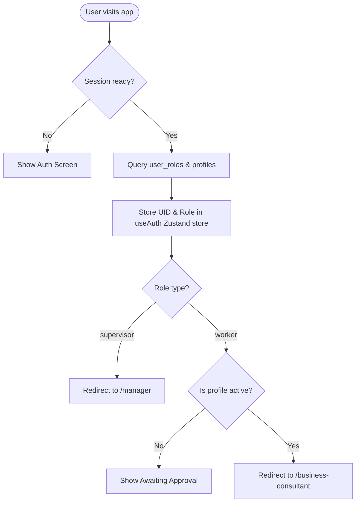

# SIM-Kit Ops — Project Overview

Welcome to the **SIM-Kit Ops** project. This document serves as a complete developer guide to understanding the codebase, tech stack, data architecture, features, and run instructions.

---

## 🛠️ Technology Stack

The project is built using a modern, fast, and unified full-stack React framework:

1. **Frontend & Meta-Framework**:
   - **React 19** (`19.2.0`): Leverages the latest React features and optimizations.
   - **TanStack Start**: A full-stack React framework built on top of **Vite** and **Nitro** (the SSR/Server engine). It offers server-side rendering (SSR), API routes, and native Server Actions.
   - **TanStack Router** (`@tanstack/react-router`): File-based, type-safe router.
   - **TanStack Query** (`@tanstack/react-query`): Robust caching, state management, and real-time query synchronization.

2. **Database & Auth (Backend)**:
   - **Supabase** (`@supabase/supabase-js`): Backend-as-a-Service powering the database, authentication, file storage, and real-time pub-sub.
   - **PostgreSQL**: Hosted in Supabase. The database layout is secured with **Row Level Security (RLS)**, ensuring different roles can access only their authorized tables/rows.
   - **Supabase Realtime**: Enables instant dashboard updates using Postgres change notifications.

3. **Styling & Components**:
   - **Tailwind CSS v4** (`tailwindcss` & `@tailwindcss/vite`): Utility-first CSS using modern compiler optimizations.
   - **Radix UI Primitives**: Accessible UI primitives (Accordion, Dialog, Select, etc.) wrapped under a unified UI kit.
   - **Lucide React**: Vector icons used across dashboards.
   - **Custom CSS Design System** (`src/styles.css`): Sets global theme variables (colors like electric lime, neon mint, and dark backgrounds), fonts (Inter, Outfit, Syne), and global styling utilities.

4. **State & Form Management**:
   - **Zustand**: Client-side auth store (`src/lib/auth-store.ts`) for caching sessions and user profiles.
   - **React Hook Form & Zod**: Form handling and schema-based validation.

5. **Helper Utilities**:
   - **jsPDF & jsPDF-AutoTable**: Generates download-ready PDF reports on the client side.
   - **date-fns**: Time arithmetic and scheduling math.
   - **sonner**: Sleek toast notification library.

---

## 📁 Folder Structure

Here is an overview of the key directories in the project:

```
SimKIt-Ops/
├── .env                          # Local database and API environment variables
├── package.json                  # Script definitions and npm dependencies
├── bun.lock                      # Lockfile for Bun package manager
├── bunfig.toml                   # Security guards and configurations for Bun
├── vite.config.ts                # Vite configurations for bundling and routing
├── create-admin.mjs              # Script to bootstrap a supervisor/manager account
├── seed-sites.mjs                # Script to seed predefined sites/factories
├── supabase/
│   └── migrations/               # PostgreSQL schema migrations (DDL & RLS)
├── public/                       # Static files (logos, fonts, images)
└── src/
    ├── components/               # React components divided by domain
    │   ├── ui/                   # Shared UI primitives (dialogs, sheets, buttons)
    │   ├── business-consultant/  # Stage-specific forms (Assessment, Installation, Commissioning)
    │   ├── inventory/            # Material & parcel management interface
    │   ├── staff/                # Manager panels (Overview, Sites, Tasks, Performance, Reports)
    │   └── ui-kit.tsx            # Unified design system component exports
    ├── hooks/                    # Custom React hooks (e.g., responsive screen checks)
    ├── integrations/
    │   └── supabase/             # Supabase clients, Typescript definitions, and SSR middleware
    ├── lib/                      # State stores, parsers, and error handlers
    │   ├── auth-store.ts         # Zustand store holding active user sessions and roles
    │   └── site-metadata.ts      # Parsers for site metadata
    ├── routes/                   # File-based TanStack routes
    │   ├── __root.tsx            # Base route (layout wrapper and providers)
    │   ├── index.tsx             # Public entry point (auto-redirects based on role)
    │   ├── auth.tsx              # Sign In, Sign Up, and Password Reset page
    │   ├── business-consultant.tsx # Consultant app dashboard and workflow
    │   ├── manager.tsx           # Supervisor layout wrapper
    │   ├── manager.index.tsx     # Manager dashboard (Overview component)
    │   └── manager.*.tsx         # Manager subpages (Sites, Performance, Reports, Inventory)
    ├── routeTree.gen.ts          # Auto-generated route tree by TanStack Router
    ├── router.tsx                # Hydration and instance setup for TanStack Router
    ├── start.ts                  # Client entry point
    └── styles.css                # Global Tailwind styles & design token declarations
```

---

## 🔄 Data Flow

The flow of data throughout the application revolves around the interaction between the **Supabase PostgreSQL database**, **Zustand Auth Store**, and the **Vite-Nitro server/client app**:

### 1. User Authentication & Authorization


### 2. Site Operations & Progress Tracker
1. **Creation**: A Manager adds a site (factory) via the **Sites Panel**. A row is created in the `sites` table.
2. **Assignment & Scheduling**: The Manager assigns a Business Consultant (worker) and schedules an appointment date/time.
3. **Synchronization**: The worker's dashboard fetches assigned sites. Real-time updates are pushed via Supabase PostgreSQL channel subscriptions, automatically refreshing the UI if the site data changes.
4. **Operations Log**: As the consultant works through the site checklist, they submit phase details.
   - The progress updates the corresponding stage table: `assessment`, `installation`, or `commissioning`.
   - The data is stored inside a `data` JSONB field containing forms, checklists, and metadata.
   - Files and photos are uploaded to Supabase Storage and logged in the `media` table.
5. **Completion**: When the final **Commissioning Phase** is completed, the site status transitions to "Billing" or "Completion" stage. The Manager sees these progress ticks instantly on the Overview metrics dashboard.

### 3. Inventory & Logistics
- **State**: Tracked via `inventory_parcels` and `inventory_materials` tables.
- **Access Control**:
  - **Managers** have full CRUD write permissions to add/update parcels (shipping details, carriers, status) and materials (raw material levels, quantities, storage hubs).
  - **Business Consultants** have read-only permissions to query this live inventory directly from their dashboard.

---

## ✨ Key Features

1. **Multi-Role Access Control**:
   - **Worker (Business Consultant)**: Accesses specific assignments, fills checklists, uploads media, and views logistics.
   - **Supervisor (Manager)**: Controls site pipelines, assigns work, views KPI metrics, manages logistics, and creates custom fields.
   - **Owner**: Full administrator access, including modifications of global settings.

2. **Manager Overview Dashboard**:
   - High-level KPIs (sites count, active consultants, and completed phases).
   - Trend charts mapping sites added vs. completed over the last 30 days.
   - Punctuality metrics tracking early, on-time, and late visits.
   - Warning lists showing "stuck sites" (un-updated in the past 7 days) and upcoming appointments.

3. **Pipelines & Operations Checklist**:
   - Dynamic questionnaire checklists split into three distinct operations steps.
   - File attachment uploader (supporting inspection images, site documentation, and minutes of meeting documents).

4. **Live Logistics Tracker**:
   - Live parcel logs showing shipment updates (carrier details, locations, ETAs).
   - Material inventory counting quantities and flagging low-stock items.

5. **PDF Report Export**:
   - Downloadable summaries compiling site progress and data grids into formatted PDFs.

---

## 🚀 How to Run the Project

### Prerequisites
- **Node.js** (v18+) or **Bun** installed.
- Access to the internet (for the Supabase database connection).

### 1. Install Dependencies
Run the installation command in the project root:
```bash
# If using Bun (recommended)
bun install

# If using npm
npm install
```

### 2. Configure Environment Variables
Verify or update the `.env` file in the root directory:
```env
SUPABASE_PROJECT_ID="mbycybczlccvgcqdlqwj"
SUPABASE_PUBLISHABLE_KEY="eyJhbGciOiJIUzI1NiIsInR5cCI6IkpXVCJ9..."
SUPABASE_URL="https://mbycybczlccvgcqdlqwj.supabase.co"
VITE_SUPABASE_PROJECT_ID="mbycybczlccvgcqdlqwj"
VITE_SUPABASE_PUBLISHABLE_KEY="eyJhbGciOiJIUzI1NiIsInR5cCI6IkpXVCJ9..."
VITE_SUPABASE_URL="https://mbycybczlccvgcqdlqwj.supabase.co"
```

### 3. Start Development Server
Start the local server. The TanStack Start router will run, and the app will open:
```bash
# Using Bun
bun run dev

# Using npm
npm run dev
```
By default, the server runs on [http://localhost:3000](http://localhost:3000).

### 4. Create an Admin/Manager Account
To log in as a supervisor, you can bootstrap an admin account:
1. In your terminal, set variables:
   ```powershell
   # Windows PowerShell
   $env:ADMIN_EMAIL="manager@example.com"
   $env:ADMIN_PASSWORD="SecurePassword123"
   ```
2. Execute the admin creation script:
   ```bash
   node create-admin.mjs
   ```
3. *(Optional)* Confirm the user or disable email verification in your Supabase authentication console if the script reports that verification is required.

### 5. Seed Initial Sites
To populate the database with the pre-defined list of factory sites:
```bash
node seed-sites.mjs manager@example.com SecurePassword123
```

### 6. Build for Production
To generate a production-ready package:
```bash
# Using Bun
bun run build

# Using npm
npm run build
```
You can preview the production bundle locally using `bun run preview` (or `npm run preview`).
